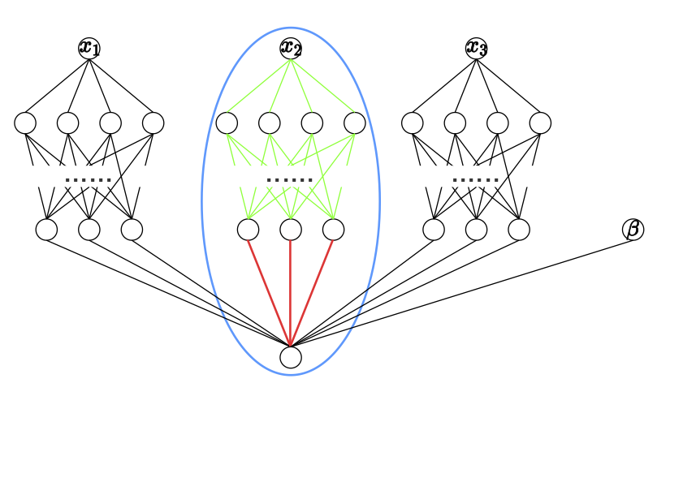

# SNAM
This is a codebase for the paper [Sparse Neural Additive Model: Interpretable Deep Learning with Feature Selection via Group Sparsity](https://arxiv.org/pdf/2202.12482.pdf).
<p align="center">
  
</p>
<p>
  <em> Figure 1: Architecture of NAM, with each sub-network (blue circle) being a group for Group LASSO regularization in SNAM. Note that in multi-class, multi-label, and multi-task problems, the last layer can have multiple neurons.</em>
</p>

## Highlights
* We propose an innately interpretable model -- sparse neural additive model (SNAM) -- to empower NAM with feature selection. In particular, SNAM can employ the Group LASSO penalty in a unique way to regularize each sub-network's parameters as one group. Note that we can easily extend to other group sparsity within SNAM, such as the Group SLOPE (see Appendix B.2).
* We employ efficient optimizers, such as the subgradient and proximal methods (see Appendix B.1), to train SNAM with provable convergence.
* We establish an interesting connection between the LASSO and the SNAM with Group LASSO regularization, showing that the LASSO is indeed a sub-case of SNAM. Building on top of this, we rigorously derive the slow rate and the support recovery of SNAM. We show that SNAM approximates the true model, selects important features in a sample-efficient manner, and identifies individual functions $f_j$ asymptotically.
* We empirically validate our results and advocate the effectiveness of SNAM via synthetic and real datasets. For example, SNAM can be $3 \times$ faster than SPAM and save half of parameters in NAM, while preserving comparable performance.

## Datasets
The california housing dataset can be found in [sklearn.datasets](https://scikit-learn.org/stable/modules/generated/sklearn.datasets.fetch_california_housing.html). For the COMPAS, We follow the data preprocessing from [this Github](https://github.com/propublica/compas-analysis). People can download the super-conductivity dataset [here](https://archive.ics.uci.edu/ml/datasets/superconductivty+data).

## Citation
Please cite our paper if you use SNAM in your papers, as follows:
```
@article{xu2022sparse,
  title={Sparse Neural Additive Model: Interpretable Deep Learning with Feature Selection via Group Sparsity},
  author={Xu, Shiyun and Bu, Zhiqi and Chaudhari, Pratik and Barnett, Ian J},
  journal={arXiv preprint arXiv:2202.12482},
  year={2022}
}
```
